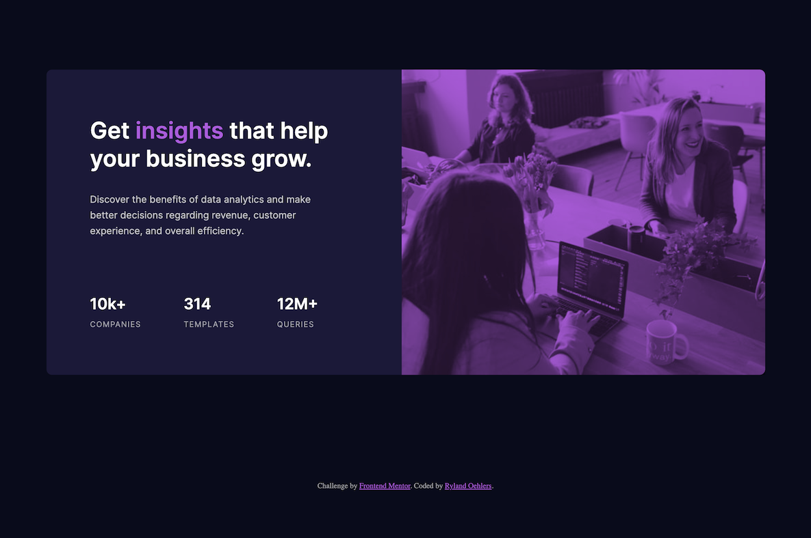
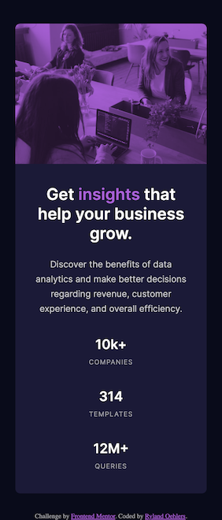

# Frontend Mentor - Stats preview card component solution

This is a solution to the [Stats preview card component challenge on Frontend Mentor](https://www.frontendmentor.io/challenges/stats-preview-card-component-8JqbgoU62). Frontend Mentor challenges help you improve your coding skills by building realistic projects. 

## Table of contents

- [Overview](#overview)
  - [The challenge](#the-challenge)
  - [Screenshot](#screenshot)
  - [Links](#links)
- [My process](#my-process)
  - [Built with](#built-with)
  - [What I learned](#what-i-learned)
  - [Continued development](#continued-development)
  - [Useful resources](#useful-resources)
- [Author](#author)
- [Acknowledgments](#acknowledgments)

## Overview

### The challenge

Users should be able to:

- View the optimal layout depending on their device's screen size

### Screenshot

### Links

- Solution URL: [Github Repo Code](https://github.com/rylandinthesun/frontend-mentor-card-component)
- Live Site URL: [Live Site](https://rylandinthesun.github.io/frontend-mentor-card-component/)

## My process

### Built with

- Semantic HTML5 markup
- CSS custom properties
- Flexbox
- CSS Grid
- Mobile-first workflow
- SCSS

### What I learned

This exercise was pretty easy for the most part. I have to learn about adding a color hue overlay to an image which I had never done before. I used a couple different solutions but found that the solution I used seemed the most efficient and simple.

### Continued development

In this excercise I mostly used flexbox for everything and grid just to center the card. I want to continue learning grid layouts since they seem beneficial for responsive layouts.

## Author

- Website - [Ryland Oehlers](https://www.rylandoehlers.com)
- Frontend Mentor - [@rylandinthesun](https://www.frontendmentor.io/profile/rylandinthesun)
- Twitter - [@rylandinthesun](https://www.twitter.com/rylandinthesun)

